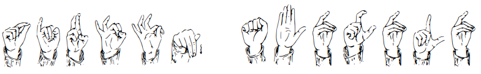

# Pirštų abėcėlė

Čia rasite kompiuterinį šriftą su lietuviška pirštų abėcėle, kurią kurtieji ir kurčnebyliai vartoja vietovardžiams ir kitiems žodžiams, neturintiems atskirų gestų.

Šriftas padarytas pirštų abėcėlės paveikslo, pateikiamo [Lietuvos kurčiųjų ir neprigirdinčiųjų ugdymo centro](http://www.deafcenter.lt/gestu-kalba/) svetainėje bei [Neįgaliųjų reikalų departamento](http://www.ndt.lt/) prie Socialinės apsaugos ir darbo ministerijos pateikiamo [Lietuvių gestų kalbos žodyno](http://lgkz.ndt.lt/pirstu-abecele) svetainėje, pagrindu. Šio paveikslo kopija padėta į aplanką `images`.

Šis JPEG formato paveikslas pirmiausia buvo sukreivintas (tam pasinaudota [vectorization.org](https://www.vectorization.org/) paslauga, o jos darbo rezultatas taip pat guli aplanke `images`). Gautasis SVG failas [„GIMP“](https://www.gimp.org) programa vėl paverstas rastriniu vaizdu (tačiau didesniu), tada [„Glyphtracer“](https://github.com/jpakkane/glyphtracer) programa konvertuotas į [„FontForge“](https://fontforge.org/) projekto failą, tada dar pakoreguotas šioje programoje ir eksportuotas [UFO 3 formatu](https://unifiedfontobject.org/).

Ankstesnėje versijoje procesas buvo kitoks, tačiau jo rezultate keliasdešimties glifų šrifto failui prireikė virš 500KB vietos. Panašu, kad kontūrai buvo sukreivinti perdėm tiksliai – „FontForge“ net skundėsi dėl taškų kiekio. Dabar gaunamas išvesties failas gerokai mažesnis.

Šį šriftą laikau eskizu pasižaidimams ir/arba pamatu galimiems tolimesniems darbams (*proof of concept*). Šiuo metu jam taikoma [OFL licencija](https://openfontlicense.org/), tačiau noriu atkreipti dėmesį, jog pačių piešinių autorystė man nepriklauso, o gauti leidimą juos šriftui naudoti aš irgi nebandžiau.

### Parsisiuntimas

[Parsisiųsti šriftą](https://github.com/rimas-kudelis/lithuanian-sign-alphabet-font/releases)

# Lithuanian Sign Alphabet font

Here you can find a Lithuanian Sign Alphabet font file.

It was generated from the original reference file in JPEG format, which is available from the websites of the [Center for Education of Deaf and Hard of Hearing of Lithuania](http://www.deafcenter.lt/en/) and the [Departament for the Affairs of the Disabled under the Ministry of Social Security and Labour](http://www.ndt.lt/en/). A copy of the original JPEG image has been placed into the `images` folder of this repository along with its vectorized version.

Conversion from the original JPEG file was performed in multiple steps. Different applications and online services (vectorization.org, GIMP, Glyphtracer) were used to generate a FontForge SFD file, which was then further improved in FontForge itself. Initially, I used a different process, but it resulted in a huge TTF file, so I figured I'd try again. Either way, all of this was done in about half a day, so I tend to see the result as a proof of concept, not a finished product.

A [UFO 3 package](https://unifiedfontobject.org/) generated by FontForge is probably the closest you could get to a workable "source form" of the font. I distributed a FontFogge SFD file initially, but it appears UFO is the preferred way for distrivuting open-source fonts nowadays.

The font is currently licensed under [OFL](https://openfontlicense.org/) with a caveat that I don't own the original design and never applied for a permission to use it. Still, seeing it available on governmental websites, I doubt it would cause an issue.

### Download

[Download the font](https://github.com/rimas-kudelis/lithuanian-sign-alphabet-font/releases)
